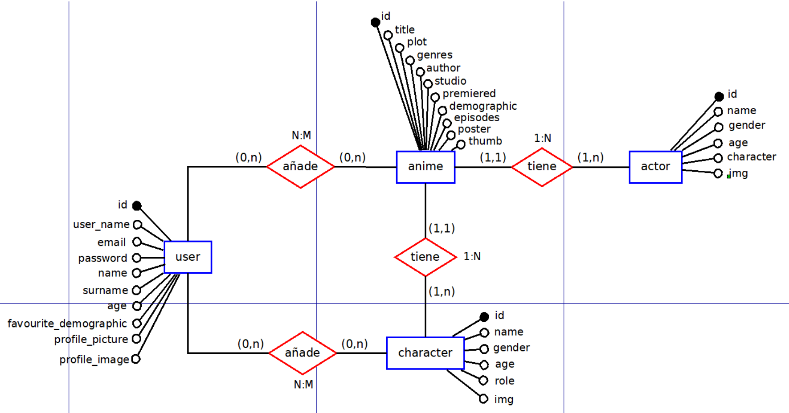
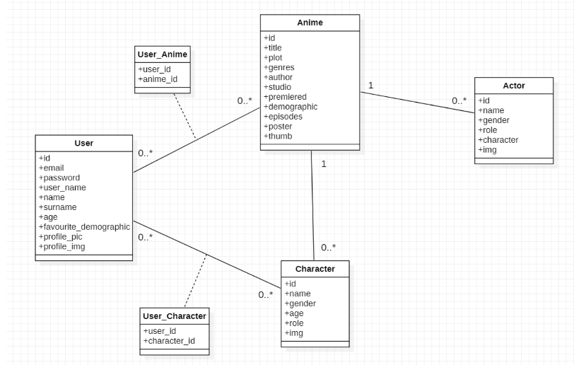
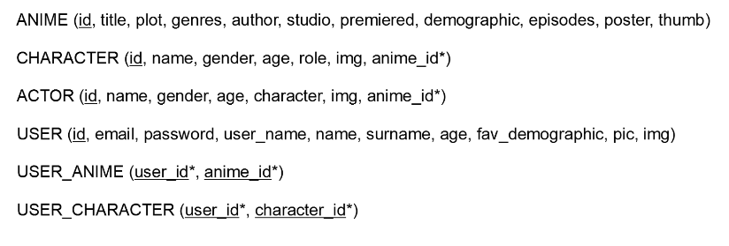

<br/>
<div align="center">
  <a href="https://github.com/PdgarHern/ReactWithRubyUsingPostregSQL">
    
  </a>

  <h3 align="center">Anime info web using React, Ruby and PostreSQL</h3>
  <div flex-direction="row">
    
    
    
  </div>
  <br/>
</div>

<details>
  <summary>Index</summary>
  <ol>
    <li>
      <a href="#react-and-ruby-on-rails-web-app">React and Ruby on Rails Web App</a>
      <ul>
        <li><a href="#need-source">Need Source</a></li>
        <li><a href="#demanding-company">Demanding Company</a></li>
        <li><a href="#summarized-idea">Summarized idea</a></li>
      </ul>
    </li>
    <li>
      <a href="#data-model">Data Model</a>
      <ul>
        <li><a href="#entities">Entities</a></li>
        <li><a href="#relathionships">Relathionships</a></li>
      </ul>
    </li>
    <li>
      <a href="#user-requirements">User Requirements</a>
    </li>
  </ol>
</details>

# React and Ruby on Rails Web App
Welcome to -*Your Anime Database*-, a web Anime info based app made up using React for the client and a Ruby on Rails API.<br/>
This is an app where you can store and check data about your favourite series, their actors and characters, and even create a 'Favourite' list for either the animes and characters.<br/>
<br/>
With its design and search engine, it makes incredibly easy looking up for what you're looking for. It comes with a register and login system, where you can create your own user, modify your profile and, by becoming and admin, administrate all the info in the database.

### Need Source
Anime's popularity has grown so much in recent times, and the demand for fast answers its even bigger.<br/>
Therefore, is logical to think of the possible usage of a fast and user firendly web app where you can store all this information that everyone is talking about at this moment.

### Demanding Company
This is a personal project *(The technologies used where demanded by Usabi)*

### Summarized idea
So, the idea of the project is to create a place to store and easily find information about animes, actors and characters, giving the tools to make it as comfortable as possible.
<br/>

# Data Model
Next, I will describe how the database is made, the entities and relathionships that exist and all the atributes.

### Entities
For this app, I created four entities: *Anime*, *Actor*, *Character* and *User*.<br/><br/>

<br/><br/>
They all have a unique *id*, base of an auto-incrising integer assigned by the database.<br/>
The rest of the attributes are mostly strings, except from the following:<br/>
<ol>
  <li>
    Anime:
    <ul>
      <li>Premiered: Integer</li>
      <li>Episodes: Integer</li>
      <li>Poster: Image</li>
      <li>Thumb: Image</li>
    </ul>
  </li>
  <li>
    Actor:
    <ul>
      <li>Age: Integer</li>
      <li>Img: Image</li>
    </ul>
  </li>
  <li>
    Character:
    <ul>
      <li>Age: Integer</li>
      <li>Img: Image</li>
    </ul>
  </li>
  <li>
    User:
    <ul>
      <li>Age: Integer</li>
      <li>Profile_picture: Image</li>
      <li>Profile_image: Image</li>
    </ul>
  </li>
</ol>

###
For the first three entities, you don't have too much restrictions. You just need a title or a name to create an entry.<br/>
For the rest attributes you just have to put the correct data and there you go.<br/>
<br/>
For the *User* you have to sign up with a valid email, and the password has to have at list six characters. You also need to provide a *user_name*.

### Relathionships
As seen before, there are four relathionships between the four entities.<br/>
They are the following:<br/>
<ol>
  <li>Anime-Actor: One Anime has many Actors / One Actor belongs to one Anime</li>
  <li>Anime-Character: One Anime has many Characters / One Character belongs to one Anime</li>
  <li>User-Anime: One User has many Animes / One Anime has many Users (this is used for the 'Favourite' list)</li>
  <li>User-Character: One User has many Characters / One Character has many Users (this is used for the 'Favourite' list)</li>
</ol>

###
Here we can see that we have two One to many and two Many to many relathionships.<br/>
As you would now, we then have to add one more attribute to *Actor* and *Character*. The *id* of the *Anime* they belong to.<br/>
<br/>
We also then have to create two more tables. One for each Many to many relathionship.<br/>
We add these:
<ol>
  <li>User-Anime: With the User Id and the Anime Id</li>
  <li>User-Character: With the User Id and the Character Id</li>
</ol>



###
To see the postgre database generation code, head to ```animes/db/schema.rb```

# User Requirements

<!-- ### First of all
To get this app running you'll need to *NodeJS*, *Ruby 2.6.8* with *Rails 6.1* and *PostgreSQL* (I use PostgreSQL 14).<br/>
Here you have some links:<br/>
[NodeJS Download](https://nodejs.org/es/)<br/>
[Ruby Download](https://rubyinstaller.org/downloads/)<br/>
[Ruby on Rails Installation Tutorial](https://guides.rubyonrails.org/getting_started.html)<br/>
[PostgreSQL Download](https://www.enterprisedb.com/downloads/postgres-postgresql-downloads)<br/>

### Get the app running
Once you have everything downloaded and installed you'll need to run a few things in the command prompt.<br/>
I recommend using the *Git Bash*. It's comfortable and shouldn't give you any problem.<br/>
[Git Download](https://git-scm.com/downloads)

### Backend
The Backend is created with Ruby on Rails and uses PostgreSQL for the database.<br/>
<br/>
In the *Backend* you need to run ```bundle install``` and ```rails db:setup```.<br/>
<br/>
Also, you will have to create a file called *application.yml* inside the *config* folder.<br/>
In that file, you will have to write the following:<br/>
```
development:
  host_postgres: your_host
  port_postgres: "your_port"
  username_postgres: your_user
  password_postgres: your_password
```
This is done this way for security reasons.<br/>
<br/>
If you want to insert some test data into the database I recomend using Postman.<br/>
[Postman Download](https://www.postman.com/downloads/)<br/>

### Frontend
This is an early version of the project so, for now there is not much to see here really.<br/>
However you can see some information displaying on the screen and some routes are already created.<br/>
<br/>
The *Frontend* preparation is easy. You just have to run ```npm install```.

### Starting the app
Both *Ruby on Rails* and *React* uses port 3000.<br/>
However, run the *Backend* with ```rails s``` and then, when you run *React* using ```npm start``` it will auto select another port.<br/><br/>
Is possible that running ```rails s``` throughs you an error the first time. The terminal will require you to run ```yarn install --check-files```. Do so and then you should be able to run the server as normally.<br/><br/>
In further commits, the installation guide may be updated if necessary. -->
