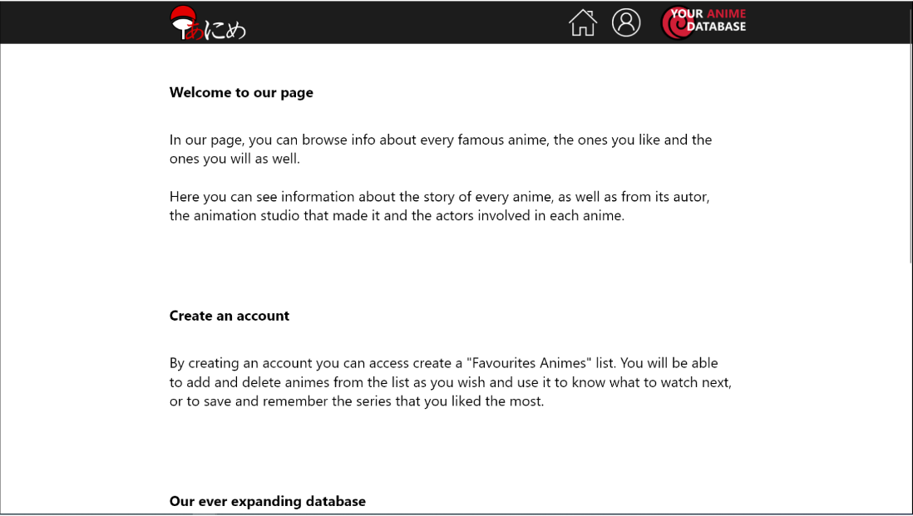
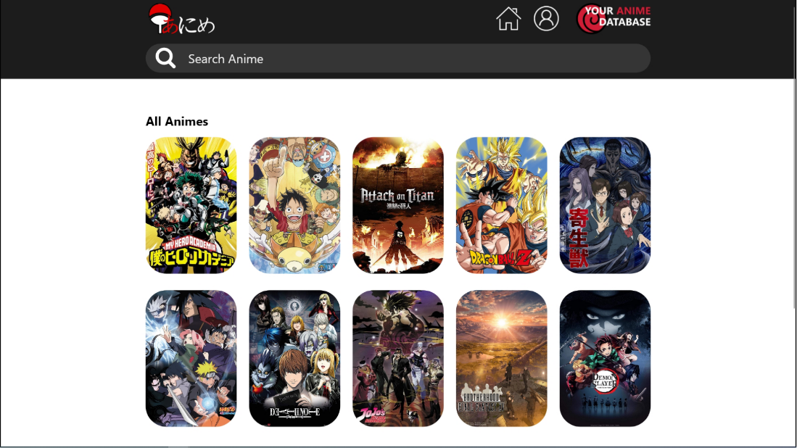
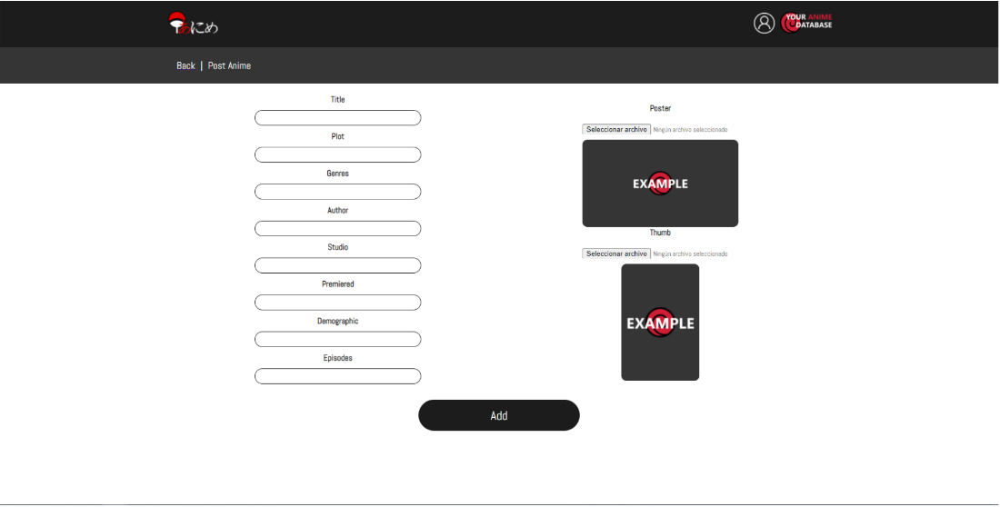
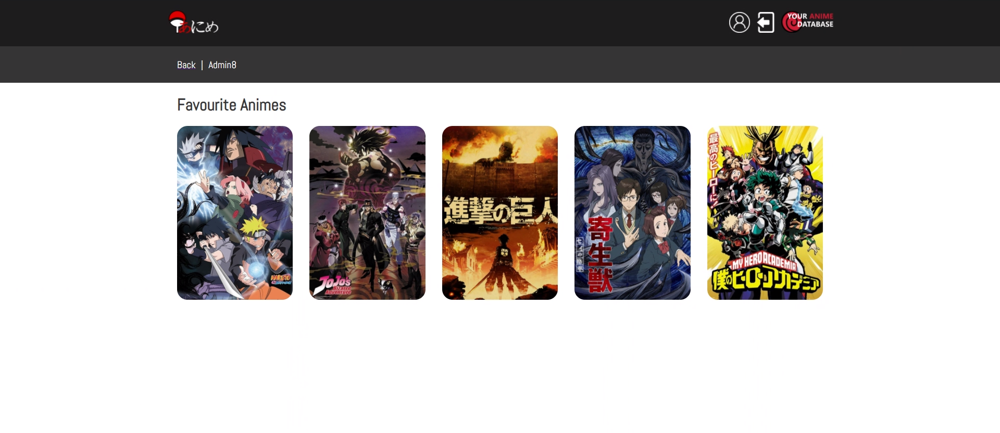

<br/>
<div align="center">
  <a href="https://github.com/PdgarHern/ReactWithRubyUsingPostregSQL">
    
  </a>

  <h3 align="center">Anime info web using React, Ruby and PostreSQL</h3>
  <div flex-direction="row">
    
    
    
  </div>
  <br/>
</div>

<details>
  <summary>Index</summary>
  <ol>
    <li>
      <a href="#react-and-ruby-on-rails-web-app">React and Ruby on Rails Web App</a>
      <ul>
        <li><a href="#need-source">Need Source</a></li>
        <li><a href="#demanding-company">Demanding Company</a></li>
        <li><a href="#summarized-idea">Summarized idea</a></li>
      </ul>
    </li>
    <li>
      <a href="#data-model">Data Model</a>
      <ul>
        <li><a href="#entities">Entities</a></li>
        <li><a href="#relathionships">Relathionships</a></li>
      </ul>
    </li>
    <li>
      <a href="#user-requirements">User Requirements</a>
      <ul>
        <li><a href="#user-cases">User Cases</a></li>
      </ul>
    </li>
    <li>
      <a href="#system-functioning-and-requirements">System requirements and functioning</a>
    </li>
    <li>
      <a href="#interfaces">Interfaces</a>
      <ul>
        <li><a href="#usability">Usability</a></li>
      </ul>
    </li>
    <li>
      <a href="#guides">Guides</a>
      <ul>
        <li><a href="#installation-guide">Installation guide</a></li>
        <ul>
          <li><a href="#first-of-all">First of all</a></li>
          <li><a href="#backend">Backend</a></li>
          <li><a href="#frontend">Frontend</a></li>
          <li><a href="#starting-the-app">Starting the app</a></li>
        </ul>
        <li><a href="#use-guide">Use guide</a></li>
      </ul>
    </li>
    <li>
      <a href="#technologies-comparison">Technologies comparison</a>
      <ul>
        <li><a href="#react">React</a></li>
        <li><a href="#ruby-on-rails">Ruby on Rails</a></li>
        <li><a href="#postgresql">PostgreSQL</a></li>
      </ul>
    </li>
    <li>
      <a href="#work-planning">Work Planning<a>
    </li>
    <li>
      <a href="#conclusion-and-opinion">Conclusion and opinion</a>
    </li>
    <li>
      <a href="#repositories-and-links-used">Repositories and links used</a>
    </li>
  </ol>
</details>

# React and Ruby on Rails Web App
Welcome to -*Your Anime Database*-, a web Anime info based app made up using React for the client and a Ruby on Rails API.<br/>
This is an app where you can store and check data about your favourite series, their actors and characters, and even create a 'Favourite' list for either the animes and characters.<br/>
<br/>
With its design and search engine, it makes incredibly easy looking up for what you're looking for. It comes with a register and login system, where you can create your own user, modify your profile and, by becoming and admin, administrate all the info in the database.

### Need Source
Anime's popularity has grown so much in recent times, and the demand for fast answers its even bigger.<br/>
Therefore, is logical to think of the possible usage of a fast and user firendly web app where you can store all this information that everyone is talking about at this moment.

### Demanding Company
This is a personal project *(The technologies used where demanded by Usabi)*

### Summarized idea
So, the idea of the project is to create a place to store and easily find information about animes, actors and characters, giving the tools to make it as comfortable as possible.
<br/>

# Data Model
Next, I will describe how the database is made, the entities and relathionships that exist and all the atributes.

### Entities
For this app, I created four entities: *Anime*, *Actor*, *Character* and *User*.<br/><br/>

<br/><br/>
They all have a unique *id*, base of an auto-incrising integer assigned by the database.<br/>
The rest of the attributes are mostly strings, except from the following:<br/>
<ol>
  <li>
    Anime:
    <ul>
      <li>Premiered: Integer</li>
      <li>Episodes: Integer</li>
      <li>Poster: Image</li>
      <li>Thumb: Image</li>
    </ul>
  </li>
  <li>
    Actor:
    <ul>
      <li>Age: Integer</li>
      <li>Img: Image</li>
    </ul>
  </li>
  <li>
    Character:
    <ul>
      <li>Age: Integer</li>
      <li>Img: Image</li>
    </ul>
  </li>
  <li>
    User:
    <ul>
      <li>Age: Integer</li>
      <li>Profile_picture: Image</li>
      <li>Profile_image: Image</li>
    </ul>
  </li>
</ol>

###
For the first three entities, you don't have too much restrictions. You just need a title or a name to create an entry.<br/>
For the rest attributes you just have to put the correct data and there you go.<br/>
<br/>
For the *User* you have to sign up with a valid email, and the password has to have at list six characters. You also need to provide a *user_name*.

### Relathionships
As seen before, there are four relathionships between the four entities.<br/>
They are the following:<br/>
<ol>
  <li>Anime-Actor: One Anime has many Actors / One Actor belongs to one Anime</li>
  <li>Anime-Character: One Anime has many Characters / One Character belongs to one Anime</li>
  <li>User-Anime: One User has many Animes / One Anime has many Users (this is used for the 'Favourite' list)</li>
  <li>User-Character: One User has many Characters / One Character has many Users (this is used for the 'Favourite' list)</li>
</ol>

###
Here we can see that we have two One to many and two Many to many relathionships.<br/>
As you would now, we then have to add one more attribute to *Actor* and *Character*. The *id* of the *Anime* they belong to.<br/>
<br/>
We also then have to create two more tables. One for each Many to many relathionship.<br/>
We add these:
<ol>
  <li>User-Anime: With the User Id and the Anime Id</li>
  <li>User-Character: With the User Id and the Character Id</li>
</ol>


###
To see the postgre database generation code, head to <a href="animes/db/schema.rb">animes/db/schema.rb</a>

# User Requirements
<ol>
  <li>
  
### Platform
  </li>
    <ul>
      <li>The project will be a web app</li>
    </ul>
</ol>
The main objective of the project was to create a web app for storing, managing and checking *anime* and related information.<br/>
The app needed to have an *anime* searching engine, a place where you could either see every *anime* in the database or to search the one that you want to check.<br/>
Every *anime* had to have to more lists related to them.<br/>
The first one had to be the *actors*, and you would see that in the same page where you would check all the information of an *anime*.<br/>
The second list would be a *character* list. This list would be in a different page that you could access from the *anime info page*.<br/>
Also, *actors* and *characters* would also have an individual info page.<br/><br/>
For the *users*, they would have three related pages.<br/>
The first one would be a personal page. It would be a page where every *user* could see and change their own personal info.<br/>
The other two would be lists, like the ones that we already had.<br/>
One of those lists would be for the *'Favourite Animes'* list, and the second one would be for the *'Favourite Characters'*.<br/>
The routes and links would work like in the normal lists and every *user* could add or delete entries on this lists.<br/>
There would be two *user roles*:
<ol>
  <li>Normal Users</li>
  <li>Admin Users</li>
</ol>

###
Only the *Admin Users* could create, update or delete registers of the main tables.<br/>
<br/>
Lastly, you would have a *Home page* and an *About Us* page with some information about the app.

### User Cases


# System functioning and requirements
We could say that this project is divided in three parts:<br/>
<ol>
  <li>Frontend / Web Client: Made using React</li>
  <li>Backend / API: Made using Rails</li>
  <li>Database: Made with PostgreSQL</li>
</ol>

###
When using the app, you interact directly with the *Web Client*.<br/>
This provides a good looking, easy way to manage and check the information from the *database* in a way that everyone can understand.<br/>
However, there is still one step in between the *Web Client* and the *database*. And that is the *API*.<br/>
The *API* acts like an interpreter between the other two parts of the project.<br/> 
It communicates with the *database* in a certain way it understands (SQL sentences) and also transforms all what have to do with the tables and the relathionships between them into objects to make it easier for the *Web Client* to understand.<br/>
<br/>


###
To run this app you can use whatever computer you have and having the necessary tools installed.<br/>
Then you can access the *Web Client* with your same computer or using even your phone.

# Interfaces
Now, you can see some screenshots of the project mockups and prototype:<br/>
<ol>
  <li>Home</li>
  <br/>
  <ul>
    
  </ul>
  <br/>
  <li>About Us</li>
  <br/>
  <ul>
    
  </ul>
  <br/>
  <li>Browse Info</li>
  <br/>
  <ul>
    
  </ul>
  <br/>
  <li>Anime</li>
  <br/>
  <ul>
    
  </ul>
  <br/>
  <li>Characters</li>
  <br/>
  <ul>
    
  </ul>
  <br/>
  <li>Login</li>
  <br/>
  <ul>
    
  </ul>
  <br/>
  <li>Register</li>
  <br/>
  <ul>
    
  </ul>
  <br/>
  <li>User Page</li>
  <br/>
  <ul>
    
  </ul>
  <br/>
  <li>Posts Pages</li>
  <br/>
  <ul>
    
  </ul>
  <br/>
  <li>Update Pages</li>
  <br/>
  <ul>
    
  </ul>
</ol>

### Usability
Is all about *simplicity*. Its visual design and elements were made with the idea of making it easy.<br/>
Easy to read, easy to interact... easy to use.<br/>
<br/>
The *navigation* is easy to learn and remember for the user.<br/>
The information shown is displayed in a way that it's easy to found what you are looking for in a short period of time.<br/>
<br/>
The visual design as a whole is minimalistic.<br/>
The app goes on with four main colors:<br/>
<ol>
  <li>White (#fff)</li>
  <li>Light Grey (#eee)</li>
  <li>Medium Grey (#353535)</li>
  <li>Dark Grey (#1c1c1c)</li>
</ol>
<br/>


###
I really like to use these kind of soft colors, which I think to be elegant and not disturbing in any way to the eyes of the user.<br/>
The app also makes use of *red* some times (for the logo and error messages).<br/>
<div flex-direction="row" align="center">
  
  
</div>

###
Talking about errors, these have been kwnown to *not* happen in the normal execution of the program.<br/>
However, and as seen before, these are correctly controlled and notified to the user whenever they happen and don't produce any internal error that isn't shown on the screen.<br/>
<br/>
The project also notifies the user in other cases, like when some information is incorrect during a sign up, or when you log out, for example.<br/>
<div flex-direction="row" align="center">
  
  
</div>

###
The project also has a loading feature so the user can always know what's happening.<br/>
<div align="center">
  
</div>

###
The user also has a *customizable page* where they can check their personal info, and the famous *'Favourite'* lists.
<div align="center">
  
  
</div>

###
Again, all these things were made with simplicity in mind. Looking for an esay and fast way to do everything while keeping good aesthetic.

# Guides
Next, I will address the guides necessary to install and get the project running:

## Installation guide

### First of all
To get this app running you'll need to install *NodeJS*, *Yarn*, *Ruby 2.6.8* with *Rails 6.1* and *PostgreSQL* (I use PostgreSQL 14).<br/>
<br/>
Here you have some links:<br/>
[ - NodeJS Download](https://nodejs.org/es/)<br/>
[ - Ruby Download](https://rubyinstaller.org/downloads/)<br/>
[ - Ruby on Rails Installation Tutorial](https://guides.rubyonrails.org/getting_started.html)<br/>
[ - PostgreSQL Download](https://www.enterprisedb.com/downloads/postgres-postgresql-downloads)<br/>
<br/>
After installing *NodeJS*, run the following command to install *Yarn*:<br/>
```
npm install -g yarn
```

###
Once you have everything downloaded and installed you'll need to run a few things in the command prompt.<br/>
I recommend using the *Git Bash*. It's comfortable and shouldn't give you any problem.<br/>
<br/>
[ - Git Download](https://git-scm.com/downloads)

### Backend
The Backend is created with *Ruby on Rails* and uses *PostgreSQL* for the database.<br/>
<br/>
*Ruby* is an interpreted, high-level programming language designed with an emphasis on programming productivity and simplicity.<br/>
*Rails* is a model-view-controller framework for *Ruby*. It is used to create server-side web applications.<br/>
*PostgreSQL* is one of the biggest relational database management systems. It emphasizes extensibility and SQL compliance.<br/>
<br/>
In the <a href="animes">animes</a> folder you need to run ```bundle install```.<br/>
If the bash doesn't recognize *bundle*, try running ```gem install bundler``` first.<br/>
<br/>
Then, head to <a href="animes/config">config</a> and delete ```credentials.yml.enc```.<br/>
Now, run the command ```EDITOR=nano rails credentials:edit``` and add the next code:<br/>
```
devise:
  jwt_secret_key: <rails secret>
```
Where it says *rails secret* you have to put the secret code that the API will use in the encryptation of user credentials.<br/>
You can generate that secret code of your own by running that same command in the bash:<br/>
```
rails secret
```
To save and close the file, press *Ctrl+X*, *Y* and then *Enter*.<br/>
<br/>
Also, you will have to create a file called ```application.yml``` inside the <a href="animes/config">config</a> folder.<br/>
To do so run the command ```bundle exec figaro install```.<br/>
In that file, you will have to write the following:<br/>
```
development:
  host_postgres: your_host
  port_postgres: "your_port"
  username_postgres: your_user
  password_postgres: your_password
```
This is done this way for security reasons, keeping all your *PostgreSQL* information in private.<br/>
<br/>
Lastly, run ```rails db:setup``` and it will generate the entire database for you. It will be empty, though.<br/>
<br/>
If you want to insert some test data into the database (Not necessary) I recomend using Postman.<br/>
To do almost every request to the database, you need to have an *auth token*. So, you'll have to sign up and sign in first.<br/>
Check the following document to see some useful screenshots:<br/>
<li>
  <a href="documentation/insert-data-guide.pdf">Insert data guide</a>
</li>

###
[ - Postman Download](https://www.postman.com/downloads/)<br/>

### Frontend
This is a *React* frontend.<br/>
*React* is a JavaScript library for building user interfaces based on UI components.<br/>
<br/>
The *frontend* preparation is easy. You just have to access <a href="animes-frontend">animes-frontend</a> and run ```npm install```.<br/>
<br/>
You don't need to have any data already in the *database* you will be able to do every action since the beginning from here.


### Starting the app
Both *Rails* and *React* uses port 3000. However, this is not a problem.<br/>
<br/>
Run the *backend* with ```rails s```.<br/>
It is possible that running ```rails s``` throughs you an error the first time. The terminal will require you to run ```yarn install --check-files```. Do so and then you should be able to run the server as normally.<br/>
<br/>
Then, run *React* using ```npm start```. It will ask to auto-select another port. Press *Y* and the app should start.

## Use guide
When you first enter the app (If you didn't insert any data) you will see an empty page.<br/>
To start filling it up, you will first need to create an account and give yourself the *Admin role*.<br/>
<br/>
<div align="center">
  
  
</div>

###
From this point, you can start creating and updating the information that you want to add to your database as well as navigating in all this easy to use application.<br/>
It's really that simple. You go to the *Anime browser* and feel that something is missing. Go ahead an press the *Add Anime* button.<br/>
<br/>
<div align="center">
  
</div>
<br/>
The same goes to the *Actors* and *Characters*.<br/>
<br/>
<div align="center">
  
  
</div>
<br/>
If the database already has some data, you may as well start as a normal user, and take advantage of the benefits of having an account by adding some animes to your *favourites* with that big *Add Fav*.<br/>
Maybe do the same with some *characters*.<br/>
<br/>
You also may want to just enter an search some information. You don't even need to sign up for that.<br/>
<br/>
Everything is there for the user. Nothing is hidden or out of view.<br/>
Just enjoy yourself.

# Technologies comparison
In this part, I'm going to compare the three technologies that I use with other ones similar to them and / or with the same purpose.

### React
Probably, the most logical comparison here for *React* is *Angular*.<br/>
<br/>
*React*, as we already know, is a JavaScript library for user interfaces creation.<br/>
*Angular* is a JavaScript framework for web and mobile development based on *TypeScript*.<br/>
<br/>
Both are used for similar purposes. Both are perfectly valid for web and mobile development, although both have some "limitations" in this last field.<br/>
*React* needs *Cordova* to work on mobile phones, and also there is an aditional library called *React Native*.<br/>
*Angular* also has an aditional framework (*NativeScript*), and great part of the job is made by *Ionic*.<br/>
<br/>
Talking about complements, *Angular* easily wins that.<br/>
It is a complete framework, and it normally doesn't need any aditional libraries.<br/>
On the other hand, from *React* can be harder to comunicate with your API, yo most probably end up using *axios*. For the routing, you'll need something like *React Router*. And the list continues.<br/>
<br/>
All this process however, is easy to learn. No hard functions, no templates. It has what it has and you get on with it. It's "simple" (Big quotation marks there).<br/>
*Angular* has *a lot* of things. To learn everything about *Angular* is challenging. But, it is well organized. So, it is easy to look for some component or whatever while developing an app.<br/>
*React* is also beaten in this aspect, as you can put your files however you want and, if you are not careful, that can end up being quite of a mess.<br/>
<br/>
Having all in consideration, I prefer *React*.<br/>
I found it really fun to use and with a lot of potencial.

### Ruby on Rails
*Ruby on Rails* is complicated. It is *easy to use* but really *hard to learn*.<br/>
As we used it to create an API with an ORM, we could compare it with *Spring Boot*.<br/>
<br/>
There are some similarities between how these kind of tools operate when creating API.<br/>
You will always need to establish the *database* information, controllers, models...<br/>
<br/>
The main thing here is that *you* have to create those in *Spring Boot*.<br/>
But, with *Rails* you just have to *run a command* and it'll do the rest for you.<br/>
Create a model, create a controller, create the migration for the *database*... everything.<br/>
Speaking of which, *Rails* also creates the *database* for you. The Schema is in one of the *Ruby* files and you don't even have to export and import the *database* or do manual changes. You just *run a command*.<br/>
<br/>
If I had to think about negative points for *Rails*, I'll found a bunch of them. But, the most important being this a comparison are these:<br/>
<ol>
  <li>It's hard to learn</li>
  <li>It's slower</li>
</ol>

###
*Rails* is hard to learn. It gives you everything done, which is great. But, if you want to change or custom something, you just don' know how.<br/>
Also, *Ruby* (As we said before) is an interpreted language, and not a fast one.<br/>
*Spring* is based on *Java*, a compiled language. This means that it takes a few seconds to start but, when it does, it is super fast.<br/>
*Rails* just isn't.<br/>
Don't get me wrong, is fast. A human can nowadays barely tell the diference between these things. But it is inevitable that, being interpreted, is going to be a bit slower.

### PostgreSQL
*PostgreSQL* is mostly like *MySQL*, which I found really easy to use.<br/>
Though you won't need to use it very much if you are using *Rails* as I did.<br/>
<br/>
I could not tell any significant difference between *Postgre* and *MySQL*. They have some syntax differences, but they work almost equaly.<br/>
<br/>
I would recommend both if they case was given.

# Work Planning
My idea was to divide everything in more specific tasks.<br/>
I also followed some rules:
<ol>
  <li>From general to detail</li>
  <ul>
    <li>This means that first I do a working CRUD and then I validate the forms, do the searcher engine, pagination...</li>
  </ul>
  <li>What I already know first</li>
  <ul>
    <li>Instead of thinking of what I don't know how to do, I just started on what I did know and leave the rest for when it was time.</li>
  </ul>
  <li>Make it work, then refine it</li>
  <ul>
    <li>Do your code, make it work. Efficiency comes later.</li>
  </ul>
</ol>

###
Following these rules, I was able to carry all this project and make it to where we are now, which is *this* point, actually:<br/>
<div align="center">
  
</div>

# Conclusion and opinion
It's been fun to work on this project.<br/>
Luckily, I could do it almost completely free, so I did it how I felt and about a topic I like.<br/>
I hadn't used *any* of the technologies before so, I had some really hard moments trying to do something seemingly imposible, just to end up achiving it in the end.<br/>
I've learnt a lot doing this project and I'm already looking forward on the next one. So yeah, that's it.

# Repositories and links used
<ol>
  <li><a href="https://youtu.be/nTeuhbP7wdE">React tutorial</a></li>
  <li><a href="https://youtu.be/fmyvWz5TUWg">Rails tutorial</a></li>
  <li><a href="https://www.youtube.com/watch?v=bUYMWalNSEA&list=PLtcYUXSfqSIdbbaa_ruHh0p_Nntidd_FR&ab_channel=CodeTuts">More Rails and React tutorial</a></li>
  <li><a href="https://github.com/activerecord-hackery/ransack">Ransack GitHub</a></li>
  <li><a href="https://github.com/kaminari/kaminari">Kaminari GitHub</a></li>
  <li><a href="https://edgeguides.rubyonrails.org/active_storage_overview.html">Active Storage page</a></li>
  <li><a href="https://medium.com/swlh/upload-images-to-your-rails-api-from-react-the-easy-way-241bbe71ea85">Active Storage tutorial</a></li>
  <li><a href="https://github.com/waiting-for-dev/devise-jwt">Devise-jwt GitHub</a></li>
  <li><a href="https://medium.com/ruby-daily/a-devise-jwt-tutorial-for-authenticating-users-in-ruby-on-rails-ca214898318e">Devise-jwt tutorial</a></li>
  <li>Countless Stack Overflow pages</li>
</ol>
